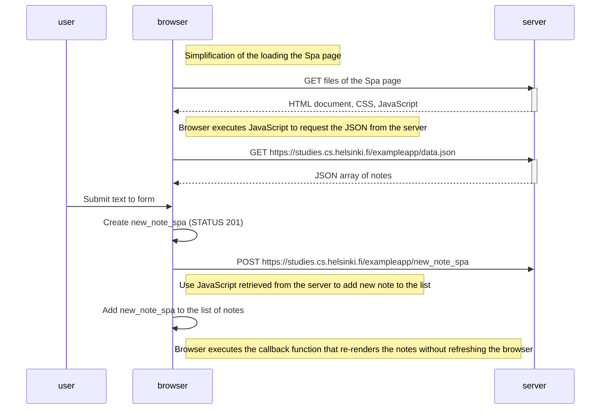

```mermaid
sequenceDiagram
    participant user
    participant browser
    participant server

    Note right of browser: Simplification of the loading the Spa page

    browser->>server: GET files of the Spa page
    activate server
    server-->>browser: HTML document, CSS, JavaScript
    deactivate server

    Note right of browser: Browser executes JavaScript to request the JSON from the server

    browser->>server: GET https://studies.cs.helsinki.fi/exampleapp/data.json
    activate server
    server-->>browser: JSON array of notes
    deactivate server

    user->>browser: Submit text to form

    browser->>browser: Create new_note_spa (STATUS 201)

    browser->>server: POST https://studies.cs.helsinki.fi/exampleapp/new_note_spa

    Note right of browser: Use JavaScript retrieved from the server to add new note to the list

    browser->>browser: Add new_note_spa to the list of notes
    
    Note right of browser: Browser executes the callback function that re-renders the notes without refreshing the browser
```